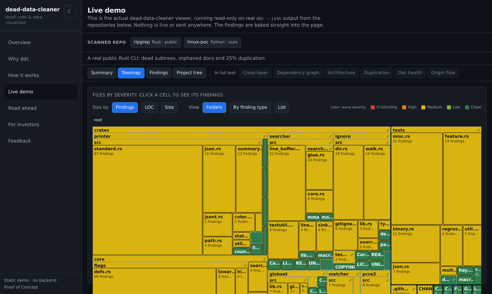

# dead-data-cleaner — demo

### ▶ [View the live demo](https://jdeworks.github.io/dead-data-cleaner-poc/)

A public, self-contained showcase for **dead-data-cleaner**, a tool that scans your
codebase (the code *and* the data) and shows the dead weight: unused symbols, orphaned
files, stale docs, duplicated blocks, and dangling config. Deterministic by default,
AI-enhanced by choice, and visual so you can trust what it flags before you delete.

[](https://jdeworks.github.io/dead-data-cleaner-poc/)

## What's inside

The page runs the **actual dead-data-cleaner viewer**, read-only, on genuine
`ddc --json` output baked straight into the site. No backend, no keys, nothing live.

- **Interactive demo** over two real public scans (the ripgrep source in Rust, and
  tmux in C): an explorable treemap, a sortable findings table with a
  per-finding evidence panel, and a project tree. Click a treemap cell to filter the
  findings for that file.
- **Advanced views** (cross-layer client/service analysis, the dependency graph,
  architecture drift, duplication, doc health, origin flow) shown as captured
  screenshots on the *Road ahead* page.
- **Light and dark** theming throughout, including the demo.
- A short **feedback survey** for early users and anyone interested.

dead-data-cleaner itself is closed source for now; this repository holds only the demo
site and the captured output it renders.

## Run it locally

```bash
npm install
npm run dev        # http://localhost:4173/dead-data-cleaner-poc/
npm run build      # builds to docs/ (committed; GitHub Pages serves this)
npm run preview    # serve the built docs/
```

Built with Vite, React, TypeScript, and Tailwind. The demo viewer is the real product's
React components, fed the baked fixtures under `public/demo/`.

## Deploy

The built output in `docs/` is committed and served directly by GitHub Pages from the
`dev` branch (Settings → Pages → Deploy from a branch → `dev` → `/docs`). To publish an
update: `npm run build`, commit `docs/`, and push.
